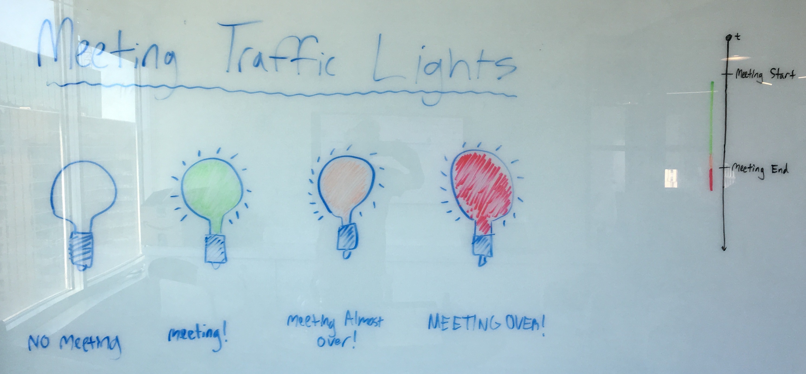

# Meeting Room Traffic Lights

A simple and fun way to show the status of meeting rooms.



Do meetings always run long in your company? Do you find yourself waiting outside of a meeting room wishing your coworkers would wrap it up? Do you wish there was a simple way to look at a meeting room and know if it is booked? Do you just want a fun way to spruce up your boring meeting rooms?

If so, Meeting Traffic Lights are the solution for you! Just buy some smart lightbulbs and stands, and run this app to 

## Requirements

- Meeting Rooms listed as Resources in Google Calendar ([more](https://support.google.com/a/answer/1686462))
- A Google Cloud Service Account 
    - Needs the following scopes: _calendar.readonly_, _admin.directory.resource.calendar.readonly_
    - Uses a `service_account_key.json` file
    - May require admin access to your organization's G Suite account.
- An AWS Account
    - With credentials to deploy a [serverless](https://serverless.com/) application to AWS Lambda.
- LIFX RGB Smart Lightbulbs (plus stands/lamps)
- A LIFX Api Token

## Setup

### Preparing Google Calendar

A "service account" is used to communicate with the Google Calendar API. Their [documentation](https://developers.google.com/identity/protocols/OAuth2ServiceAccount) best describes how to do this. The basic steps I took were the following:

1. Create a project in the Google APIs [dashboard](https://console.developers.google.com/apis/dashboard) to hold the service account.
1. Create the service account in the [IAM & admin](https://console.developers.google.com/iam-admin/serviceaccounts) section of your project.
1. Delegate domain-wide authority to the service account.
1. Log into the G Suite [Admin](http://admin.google.com/) section (as an admin user) to authorize the service account for API scopes. For listing calendar information, you need the _calendar.readonly_ scope: `https://www.googleapis.com/auth/calendar.readonly`. For listing users and rooms in the domain, you need the _admin.directory.user.readonly_ scope: `https://www.googleapis.com/auth/admin.directory.user.readonly`.
1. Go to the [credentials page](https://console.developers.google.com/apis/credentials) in the Google APIs dashboard for your project, click **Create credentials > Service account key**, select your service account and JSON as the key type, and click **Create**. This will download your credentials JSON file containing your private key which will be used in Google API SDKs.                                                                                                                                                                                                                                                                                                                                                                         

To connect, place your `service_account_key.json` file inside this application's _config/_ directory (it is git-ignored).

> You can test that it works by running the GoogleCalendarClient integration test: `jest GoogleCalendarClient`.

Lastly, you will need to choose a "subject" to query Google Calendar, which is the email address of a user in your organization who can see the calendars of your meeting rooms. I simply used my own email address. This is set via the `GOOGLE_CALENDAR_SUBJECT` environment variable.

### Deploying the Application

Deploys are done using [serverless](https://github.com/serverless/serverless). You just need to run the deploy command in an environment with valid AWS credentials.

```bash
serverless deploy       # Deploy using serverless
```

### Installing the Bulbs

Installing the bulbs are simple! We used the [LIFX Mini Color](https://www.lifx.com/collections/featured-products/products/lifx-mini-color-e26) bulb, and the [INJUICY](https://www.amazon.com/gp/product/B01FZKKTU0) bulb stands. The application will automatically pair rooms to bulbs based on the label you give the bulb in the [LIFX phone app](https://www.lifx.com/pages/go).

For example, we synced a bulb to our meeting room called "The Studio" (in Google Calen"dar) by labeling the bulb "Studio" (it matches based on sub-string):


You also need to get a [LIFX API Token](https://api.developer.lifx.com/), which is set via the `LIFX_TOKEN` environment variable. This lets the application remotely control the bulbs.

---

## Development

### Google Calendar API
A "service account" is used to communicate with the Google Calendar API.

#### Useful Links
- [Google Cloud Dashboard](https://console.cloud.google.com/home/dashboard)
